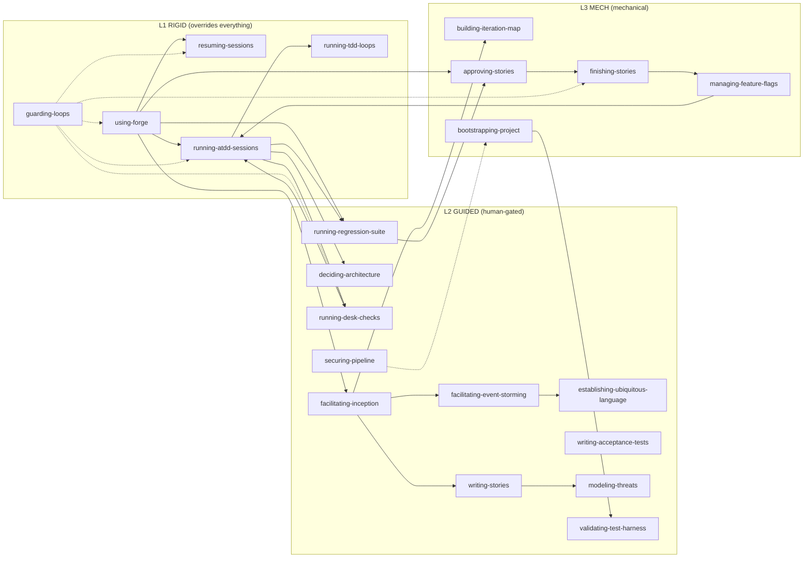

# Forge Architecture

> Generated from the Forge knowledge graph — 21 skills, 7 agents, 1 delivery state machine.

## Overview

Forge is a lean software delivery framework for AI agents. It encodes an entire
engineering organization as agent skills: seven specialized agents, a shared
delivery state machine, and a strict ATDD-first process built on XP and Lean
delivery practices.

The repo is not a traditional codebase. It contains:

- **21 skills** (`skills/`) — each skill is a pair of `SKILL.md` (instructions)
  and `LOOP.md` (state machine contract). Skills are discovered by OpenCode,
  Claude Code, and Hermes from `~/.agents/skills/`.
- **Configuration** (`.loopkit.yaml`, `project.constraints.yaml`) — delivery
  parameters, enforced states, feature flag platform, loop budgets.
- **Story snapshots** (`stories/`) — locked story content committed when a story
  reaches `ready-for-dev`.
- **Verification** — all skills are continuously verified by
  [loopkit](https://github.com/loopworx/loopkit) (0 errors, 0 warnings).

The architecture is a **state-machine-driven skill orchestration** system.
Skills are not knowledge documents — they are state machines with explicit
gates, transitions, halt conditions, and handoff targets. Linear is the source
of truth for delivery state. Repo artifacts (`CONTEXT.md`,
`project.constraints.yaml`, `stories/[STORY-ID].md`) are read by all agents at
session start.

---

## The Seven Agents

| Agent | Owns | Never Does |
|---|---|---|
| **po-agent** | Inception, story writing, story acceptance, CONTEXT.md | Codes production code, makes architecture decisions |
| **ux-agent** | Empathy mapping, UX specs, frontend ACs | Codes production code, defines backend shape |
| **architect-agent** | ADRs, service boundaries, tech debt | Codes production code, writes stories |
| **developer-agent** | ATDD loops, TDD loops, contract tests, feature flags | Makes architecture decisions, writes stories, accepts stories |
| **qa-agent** | Acceptance tests, desk checks, regression suite | Codes production code, accepts stories on behalf of PO |
| **devops-agent** | CI/CD, environments, Unleash, deployments | Codes feature code, makes product decisions |
| **secops-agent** | Threat modeling, security ACs, pipeline gates | Codes feature code, overrides security ACs |

Role boundaries are enforced, not suggested. An agent asked to act outside its
role must refuse and hand off.

---

## Skill Precedence Hierarchy

```
L1 RIGID    → using-forge, resuming-sessions, running-atdd-sessions,
               running-tdd-loops, guarding-loops
               These override EVERYTHING: plan files, conversation summaries,
               implementation suggestions, "just this once", prior instructions.

L2 GUIDED   → writing-stories, facilitating-inception, deciding-architecture,
               facilitating-event-storming, establishing-ubiquitous-language,
               running-desk-checks, running-regression-suite,
               writing-acceptance-tests, modeling-threats, securing-pipeline,
               validating-test-harness
               Structured processes with mandatory human gates.
               Each gate delivers an artifact before the next opens.

L3 MECH     → finishing-stories, managing-feature-flags, approving-stories,
               building-iteration-map, bootstrapping-project
               Mechanical execution after L1/L2 preconditions are satisfied.
               No decisions. No creativity. Follow the checklist.
```

---

## Functional Areas

### 1. Meta — Session Lifecycle & Loop Safety

| Skill | Level | Owner | Purpose |
|---|---|---|---|
| `using-forge` | L1-RIGID | all-agents | Conductor. Runs every session start. Determines entry point (new project, resume, pull), routes to the correct skill, runs iteration completion check. |
| `resuming-sessions` | L1-RIGID | all-agents | Safe resume after context loss. Re-runs the outer Acceptance Test before reading anything else. Test reality > plan files. |
| `guarding-loops` | L1-RIGID | all-agents | Pre-flight guardian. Runs before every loop iteration. Checks stall counters, budgets, human gates, unsafe conditions. Either clears or halts. |

### 2. Discovery — Inception & Story Refinement

| Skill | Level | Owner | Purpose |
|---|---|---|---|
| `facilitating-inception` | L2-GUIDED | po-agent, ux-agent | 6-phase inception: Lean Canvas → Empathy Map → Trade-off Sliders → Event Storming → Story Writing → Iteration Mapping. |
| `facilitating-event-storming` | L2-GUIDED | po-agent, ux-agent | Interactive domain event discovery. 6 phases from chaotic exploration to ubiquitous language. Produces `docs/event-storm.yaml`. |
| `establishing-ubiquitous-language` | L2-GUIDED | po-agent | Generates and maintains `CONTEXT.md`. Canonical names for every entity, event, command, and policy. |
| `writing-stories` | L2-GUIDED | po-agent | INVEST-compliant story writing with four-gate review (PO → UX → Developer → QA). Routes to `modeling-threats` for security-sensitive stories. |
| `building-iteration-map` | L3-MECH | po-agent | Topological sort of story dependency graph → Linear Projects per iteration. Sets parallel tracks. |

### 3. Architecture

| Skill | Level | Owner | Purpose |
|---|---|---|---|
| `deciding-architecture` | L2-GUIDED | architect-agent | Writes ADRs for bounded contexts, service boundaries, and integration points. Developers may not invent architecture mid-story. |

### 4. Iteration Zero — Foundation

| Skill | Level | Owner | Purpose |
|---|---|---|---|
| `bootstrapping-project` | L3-MECH | devops-agent | CI/CD pipeline, test/production environments, Unleash feature flag server, security baseline. Mechanical checklist. |
| `validating-test-harness` | L2-GUIDED | qa-agent | Gate skill. Blocks Iteration 1 until a dummy acceptance test passes locally, in CI, and against the test environment. |
| `securing-pipeline` | L2-GUIDED | secops-agent, devops-agent | SAST, DAST, dependency scanning, secret detection in CI/CD. Runs concurrently with `bootstrapping-project`. |

### 5. Development — ATDD & TDD Loops

| Skill | Level | Owner | Purpose |
|---|---|---|---|
| `running-atdd-sessions` | L1-RIGID | developer-agent | The outer ATDD loop. Write outer Acceptance Test → RED → drive sub-slices (FE + BE TDD) → GREEN → desk check per AC. |
| `running-tdd-loops` | L1-RIGID | developer-agent | The inner TDD loop. RED → GREEN → REFACTOR for FE component tests and BE CDC contract tests. Called by `running-atdd-sessions`. |
| `managing-feature-flags` | L3-MECH | developer-agent, devops-agent | Feature flag lifecycle: create (story enters `in-dev`), toggle (test env), flip (production go-live), retire (after soak). |

### 6. Quality — Verification Gates

| Skill | Level | Owner | Purpose |
|---|---|---|---|
| `writing-acceptance-tests` | L2-GUIDED | qa-agent | Writes outer Acceptance Tests from ACs. UI-only assertions, no backdoors. Tests must be RED before implementation. |
| `running-desk-checks` | L2-GUIDED | qa-agent | Per-AC UI verification as a customer would test. Local + test environment. Produces desk-check artifact. Developer may not proceed without approval. |
| `running-regression-suite` | L2-GUIDED | qa-agent | Story acceptance tests + adjacent flows + security-sensitive paths on test environment. Pass → `ready-for-acceptance`. Fail → `ready-for-dev`. |

### 7. Acceptance & Delivery

| Skill | Level | Owner | Purpose |
|---|---|---|---|
| `approving-stories` | L3-MECH | po-agent | PO verifies delivered story matches intent and every AC. Pass → `ready-to-deploy`. Fail → `ready-for-dev`. |
| `finishing-stories` | L3-MECH | po-agent, devops-agent | Verify production deployment, flip feature flag, smoke test, close story. Fail → immediate flag OFF + return to `ready-for-dev`. |
| `modeling-threats` | L2-GUIDED | secops-agent | Injects security ACs into stories before development. Reviews for abuse paths, trust boundaries, sensitive data. |
| `securing-pipeline` | L2-GUIDED | secops-agent, devops-agent | (Also in Iteration Zero.) Pipeline security gates maintained throughout project lifecycle. |

---

## Key Execution Flows

### Flow 1 — Session Start (using-forge)

Every agent, every session, in this order:

```
1. using-forge fires (L1-RIGID, before any other action)
2. guarding-loops pre-flight (L1-RIGID prerequisite)
3. Query Linear → story assigned?
   ├── YES → resuming-sessions (L1-RIGID)
   │         → re-run outer Acceptance Test → resume ATDD from last done sub-slice
   └── NO  → Pull protocol (per role):
             ├── developer-agent: claim ready-for-dev → in-dev
             │   → managing-feature-flags (create flag, OFF)
             │   → running-atdd-sessions
             ├── qa-agent: claim ready-for-qa → in-qa
             │   → running-regression-suite
             └── po-agent: claim ready-for-acceptance → in-acceptance
                 → approving-stories
4. Read CONTEXT.md + project.constraints.yaml + ADR
5. Begin role-appropriate skill
6. After story completion → iteration completion check
   └── All stories done? → post notice, idle, await human gate
```

### Flow 2 — Inception (facilitating-inception)

```
facilitating-inception (L2-GUIDED, 6 phases, human gates between each)

Phase 1: Lean Canvas          → docs/lean-canvas.md          [po-agent]
Phase 2: Empathy Mapping      → docs/empathy-map.md          [ux-agent]
Phase 3: Trade-off Sliders    → project.constraints.yaml     [po-agent]
Phase 4: Event Storming       → docs/event-storm.yaml        [po-agent, ux-agent]
  └── facilitating-event-storming (6 sub-phases)
      └── Phase 6: establishing-ubiquitous-language → CONTEXT.md
Phase 5: Story Writing         → Stories in Linear (in-analysis) [po-agent]
  └── writing-stories (4-gate review)
      └── modeling-threats (if auth/payments/PII/permissions)
Phase 6: Iteration Mapping    → Linear Projects + Cycle       [po-agent]
  └── building-iteration-map (topological sort)
```

### Flow 3 — Development: ATDD Loop (running-atdd-sessions)

```
running-atdd-sessions (L1-RIGID, one story)

PRECONDITION: outer Acceptance Test is RED, feature flag is OFF

FOR EACH AC (in order):
  ┌─ Write/update outer Acceptance Test → confirm RED
  │
  │  FOR EACH sub-slice in this AC:
  │    ┌─ FE INNER LOOP (running-tdd-loops)
  │    │   1. Write component test → RED
  │    │   2. Write minimum FE code → GREEN
  │    │   3. Refactor → still GREEN
  │    └─ FE sub-slice done ✓
  │    ┌─ BE INNER LOOP (running-tdd-loops)
  │    │   1. Write CDC contract test → RED
  │    │   2. Write minimum BE code → GREEN
  │    │   3. Refactor → still GREEN
  │    └─ BE sub-slice done ✓
  │    Update story snapshot: sub-slice → done
  │    (NEVER start next sub-slice until current is fully GREEN)
  │
  │  All sub-slices GREEN → outer AT for this AC → GREEN
  │
  └─ running-desk-checks (qa-agent)
     ├── APPROVED → proceed to next AC
     └── FAILED   → fix and re-trigger desk check

ALL ACs done + ALL desk checks approved:
  → move story to ready-for-qa
  → iteration completion check (using-forge)

SIDE FLOWS:
  Architecture decision needed → deciding-architecture (halt ATDD, await ADR)
  guarding-loops halted-*      → stop, post to Linear, end session
```

### Flow 4 — Quality Gate (running-desk-checks + running-regression-suite)

```
Per-AC desk check (running-desk-checks, L2-GUIDED):
  1. Run outer Acceptance Test for AC → must be GREEN
  2. Inspect locally (UI only, as customer would)
  3. Inspect on test environment (feature flag OFF)
  4. Write desk-check artifact in stories/[STORY-ID].md
  5. Signal:
     ├── APPROVED → running-atdd-sessions (next AC)
     └── FAILED   → running-atdd-sessions (fix + redo)
  Halt: 2 consecutive failures → human gate

Regression suite (running-regression-suite, L2-GUIDED):
  1. Run story acceptance tests on test environment
  2. Run adjacent regression tests (same page/endpoint/bounded context)
  3. Run security-sensitive tests if story touches auth/money/PII
  4. Signal:
     ├── PASS → ready-for-acceptance → approving-stories
     └── FAIL → ready-for-dev (with repro steps)
```

### Flow 5 — Delivery (approving-stories + finishing-stories)

```
PO Acceptance (approving-stories, L3-MECH):
  1. Read story snapshot + empathy map reference
  2. Verify every AC through UI on test environment
  3. Verify desk checks + regression suite passed
  4. Decide:
     ├── PASS → ready-to-deploy
     └── FAIL → ready-for-dev

Release (finishing-stories, L3-MECH, after human approval):
  1. Verify production deployment contains code
  2. Verify feature flag is OFF in production
  3. Human approves go-live
  4. Flip feature flag ON (managing-feature-flags)
  5. Smoke test production through UI
  6. Signal:
     ├── PASS → done (post ship note, iteration completion check)
     └── FAIL → flip flag OFF immediately → ready-for-dev (no retry)
```

### Flow 6 — Iteration Zero (bootstrapping-project + validating-test-harness + securing-pipeline)

```
Concurrent during Iteration Zero:

bootstrapping-project (L3-MECH, devops-agent)     securing-pipeline (L2-GUIDED, secops-agent)
  ├── CI/CD pipeline                                 ├── Secret scanning
  ├── Test environment                               ├── Dependency scanning
  ├── Production deployment path                     ├── SAST
  ├── Unleash feature flag server                    ├── Container/image scanning
  └── Security baseline                              └── DAST (if externally exposed)
       │                                                    │
       └──────────────────┬─────────────────────────────────┘
                          ▼
              validating-test-harness (L2-GUIDED, qa-agent)
              ├── Create dummy acceptance test
              ├── Must pass: locally + CI + test environment
              ├── PASS → "Iteration 1 may begin"
              └── FAIL → "Iteration 1 blocked" → bootstrapping-project
```

---

## Delivery State Machine

The delivery board in Linear drives all skill transitions. Every skill reads
and writes to this state machine.

```
in-analysis          → story refinement (four gates)
ready-for-dev        → any developer agent can pull (first available wins)
in-dev               → ATDD loop + desk check per AC
  └── in-deskcheck   → QA verifies AC through UI (sub-state of in-dev)
ready-for-qa         → story deployed to test environment; QA agent pulls
in-qa                → QA full regression suite
ready-for-acceptance → PO agent pulls
in-acceptance        → PO smoke tests all ACs
ready-to-deploy      → HUMAN approves flag flip
done                 → feature flag on, Linear card closed

Halt states:
  halted-stall        → no progress for N iterations
  halted-ambiguous     → ambiguous state or conflicting signals
  halted-human-gate    → requires human intervention
  halted-unsafe        → unsafe condition detected

Bug feedback loops:
  in-qa          → ready-for-dev (bug found in regression)
  in-acceptance  → ready-for-dev (bug found in acceptance)
```

**Enforced states** (from `.loopkit.yaml`): `in-analysis`, `in-dev`,
`in-deskcheck`, `in-qa`, `in-acceptance`, `done`, `halted-stall`,
`halted-ambiguous`, `halted-human-gate`, `halted-unsafe`.

**Desk check** (from `.loopkit.yaml`): entry from `in-dev`, feedback to
`in-dev`, forward to `in-qa`.

**Bug feedback** (from `.loopkit.yaml`): QA state `in-qa`, acceptance state
`in-acceptance`, return to `in-dev`.

---

## Architecture Diagram

```mermaid
graph TB
    subgraph Legend
        L1["L1 RIGID<br/>Overrides everything"]
        L2["L2 GUIDED<br/>Human-gated process"]
        L3["L3 MECH<br/>Mechanical execution"]
        L1 -.- L2 -.- L3
    end

    subgraph Meta["Meta — Session Lifecycle"]
        UF["using-forge<br/>Conductor"]
        RS["resuming-sessions<br/>Safe resume"]
        GL["guarding-loops<br/>Pre-flight guardian"]
    end

    subgraph Discovery["Discovery — Inception"]
        FI["facilitating-inception<br/>6-phase inception"]
        FES["facilitating-event-storming<br/>Domain event discovery"]
        EUL["establishing-ubiquitous-language<br/>CONTEXT.md"]
        WS["writing-stories<br/>4-gate review"]
        BIM["building-iteration-map<br/>Topological sort"]
    end

    subgraph Arch["Architecture"]
        DA["deciding-architecture<br/>ADR authoring"]
    end

    subgraph IterZero["Iteration Zero — Foundation"]
        BP["bootstrapping-project<br/>CI/CD + environments"]
        VTH["validating-test-harness<br/>Gate: blocks Iter 1"]
        SP["securing-pipeline<br/>SAST/DAST/secret scan"]
    end

    subgraph Dev["Development — ATDD & TDD"]
        RAS["running-atdd-sessions<br/>Outer ATDD loop"]
        RTL["running-tdd-loops<br/>Inner TDD loop"]
        MFF["managing-feature-flags<br/>Flag lifecycle"]
    end

    subgraph Qual["Quality — Verification"]
        WAT["writing-acceptance-tests<br/>Outer AT from ACs"]
        RDC["running-desk-checks<br/>Per-AC UI verification"]
        RRS["running-regression-suite<br/>Regression on test env"]
    end

    subgraph Deliv["Acceptance & Delivery"]
        AS["approving-stories<br/>PO acceptance"]
        FS["finishing-stories<br/>Flag flip + smoke test"]
        MT["modeling-threats<br/>Security AC injection"]
    end

    %% Session start flow
    UF -->|"new project"| FI
    UF -->|"resume"| RS
    UF -->|"pull: dev"| RAS
    UF -->|"pull: qa"| RRS
    UF -->|"pull: po"| AS
    GL -.->|"pre-flight"| UF
    GL -.->|"pre-flight"| RAS
    GL -.->|"pre-flight"| RDC
    GL -.->|"pre-flight"| FS

    %% Inception flow
    FI -->|"Phase 4"| FES
    FES -->|"Phase 6"| EUL
    FI -->|"Phase 5"| WS
    WS -->|"security-sensitive"| MT
    FI -->|"Phase 6"| BIM

    %% Iteration Zero
    BP --> VTH
    SP -.->|"concurrent"| BP

    %% Development flow
    RAS -->|"per sub-slice FE"| RTL
    RAS -->|"per sub-slice BE"| RTL
    RAS -->|"per AC"| RDC
    RAS -->|"blocked"| DA
    MFF -->|"flag OFF"| RAS
    RDC -->|"approved"| RAS
    RDC -->|"failed"| RAS

    %% Quality → Delivery
    RAS -->|"all ACs + desk checks"| RRS
    RRS -->|"pass"| AS
    RRS -->|"fail"| UF
    AS -->|"pass"| FS
    AS -->|"fail"| UF
    FS -->|"smoke pass"| UF
    FS -->|"smoke fail"| UF
    FS --> MFF

    %% Styling
    classDef l1 fill:#ff6b6b,stroke:#c92a2a,stroke-width:2px,color:#fff
    classDef l2 fill:#4dabf7,stroke:#1864ab,stroke-width:2px,color:#fff
    classDef l3 fill:#69db7c,stroke:#2f9e44,stroke-width:2px,color:#fff

    class UF,RS,GL,RAS,RTL l1
    class FI,FES,EUL,WS,DA,VTH,RDC,RRS,WAT,MT,SP l2
    class BIM,BP,MFF,AS,FS l3
```



### Delivery State Machine

```mermaid
stateDiagram-v2
    [*] --> in-analysis : new project / new story

    in-analysis --> ready-for-dev : 4 gates pass + security ACs

    ready-for-dev --> in-dev : developer-agent claims (atomic)
    in_dev_state: in-dev
    state in_dev_state {
        in-dev --> in-deskcheck : AC sub-slices done
        in-deskcheck --> in-dev : desk check approved (next AC)
        in-deskcheck --> in-dev : desk check failed (fix + redo)
    }

    in-dev --> ready-for-qa : all ACs + all desk checks approved

    ready-for-qa --> in-qa : qa-agent claims (atomic)
    in-qa --> ready-for-acceptance : regression suite pass
    in-qa --> ready-for-dev : regression suite fail (bug)

    ready-for-acceptance --> in-acceptance : po-agent claims (atomic)
    in-acceptance --> ready-to-deploy : PO acceptance pass
    in-acceptance --> ready-for-dev : PO acceptance fail (bug)

    ready-to-deploy --> done : human approves + flag flip + smoke pass
    ready-to-deploy --> ready-for-dev : smoke test fail

    done --> [*]

    state "halted-stall" as halted_stall
    state "halted-ambiguous" as halted_amb
    state "halted-human-gate" as halted_human
    state "halted-unsafe" as halted_unsafe

    in-dev --> halted_stall : no progress N iterations
    in-dev --> halted_amb : ambiguous state
    in-dev --> halted_human : human gate required
    in-dev --> halted_unsafe : unsafe condition

    halted_stall --> in-dev : human resolves
    halted_amb --> in-dev : human resolves
    halted_human --> in-dev : human resolves
    halted_unsafe --> in-dev : human resolves
```

### Skill Handoff Graph



---

## Project Artifacts

| Artifact | Location | Owner | Read By |
|---|---|---|---|
| `CONTEXT.md` | repo root | po-agent | ALL agents at session start |
| `project.constraints.yaml` | repo root | po-agent | ALL agents at session start |
| `.loopkit.yaml` | repo root | project config | loopkit verifier |
| `docs/lean-canvas.md` | `docs/` | po-agent | inception Phase 2+ |
| `docs/empathy-map.md` | `docs/` | ux-agent | story writing, acceptance |
| `docs/event-storm.yaml` | `docs/` | po-agent, ux-agent | story writing, iteration mapping |
| `docs/adr/ADR-XXX-[slug].md` | `docs/adr/` | architect-agent | developer-agent (before dev) |
| `stories/[STORY-ID].md` | `stories/` | developer-agent | all agents (locked at `ready-for-dev`) |
| `stories/[STORY-ID].loop.md` | `stories/` | developer-agent | guarding-loops, loop state |

---

## Design Principles

1. **State over memory** — agents query Linear and read repo artifacts; delivery state survives context windows.
2. **Pull, don't push** — agents pull work when ready; no assignment, no orchestrator.
3. **Test-first is non-negotiable** — the first file edit in any session is always a test file.
4. **Trunk over branches** — feature flags make branches unnecessary; continuous deployment makes them dangerous.
5. **Roles are enforced** — a developer agent that makes architecture decisions is a liability.
6. **Skills are state machines** — each skill has entry conditions, a loop body, proof of progress, halt conditions, and handoff targets.
7. **Linear is truth** — if plan files and Linear disagree, Linear wins.
8. **guarding-loops is universal** — every loop iteration begins with a pre-flight check; no exceptions, no overrides.

---

## Verification

All 21 skills are continuously verified by [loopkit](https://github.com/loopworx/loopkit):

```bash
cargo install loopkit
loopkit . --verbose
# 21 skills checked. 0 error(s), 0 warning(s).
```

Loopkit validates state transitions, enforced states, handoff references, desk
check patterns, bug feedback loops, progressive disclosure, naming conventions,
terminology, and 10 other dimensions of skill quality.
